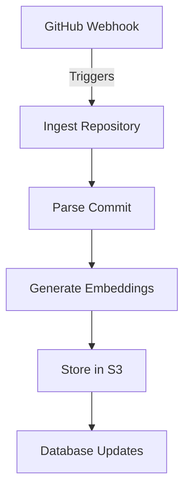

# System Architecture

## Overview
The system architecture is designed to handle the ingestion, parsing, embedding, and storage of code repositories. It utilizes AWS S3 for storage, processes GitHub webhooks for real-time updates, and employs background tasks for data processing. The architecture is modular, allowing for easy maintenance and scalability.

## How it Works
The data flow in the system can be summarized in the following steps:

1. **Ingestion**: The system listens for GitHub webhook events (e.g., repository creation, commits) and triggers the ingestion process.
2. **Parsing**: Once the repository is ingested, the code files are parsed to extract relevant information and generate chunks of data.
3. **Embedding**: The parsed data is then transformed into embeddings using an AI model, which allows for semantic search capabilities.
4. **Storage**: All processed data, including manifests and embeddings, are stored in S3, organized by tenant, owner, repository, and commit.

### Data Flow Diagram


## Key Components
- **S3 Storage Layout**: The data is organized in S3 using a structured layout:
  - **Bucket**: Defined in environment variables.
  - **Tenant ID**: Defaults to "default" if not specified.
  - **Owner/Repo/Commit**: Each repository's data is stored under its respective owner and repository name, with commits further categorized.

| Component         | Description                                                                 |
|-------------------|-----------------------------------------------------------------------------|
| Ingestion         | Handles incoming GitHub events and triggers the ingestion process.          |
| Parsing           | Processes code files to extract meaningful chunks of data.                  |
| Embedding         | Converts parsed data into vector embeddings for semantic search.            |
| Storage           | Utilizes S3 for storing manifests, chunks, and embeddings.                  |
| Database Updates   | Updates the database with commit and chunk information.                     |

### S3 Ingest Layout
```typescript
export interface S3IngestLayout {
  bucket: string;
  tenantId?: string; // "default" if omitted
  owner: string;
  repo: string;
  commit: string;
}
```

## Gotchas
- **Webhook Signature Verification**: Ensure that the webhook signature is verified to prevent unauthorized access. This is crucial for maintaining the integrity of the data being ingested [3339a3abe4b6-0001].
- **Truncated Git Tree Responses**: Be aware that Git tree responses can be truncated. In such cases, consider using tarball mode for complete data retrieval [7c8a84372a2b-0001].
- **S3 Bucket Configuration**: Ensure that the S3 bucket is correctly configured in the environment variables to avoid runtime errors during data storage [479a3b9ee8e5-0000].

## Conclusion
This architecture provides a robust framework for managing code repositories, leveraging cloud storage and AI capabilities for enhanced data processing and retrieval. For further details, refer to the respective service implementations and configurations in the codebase.