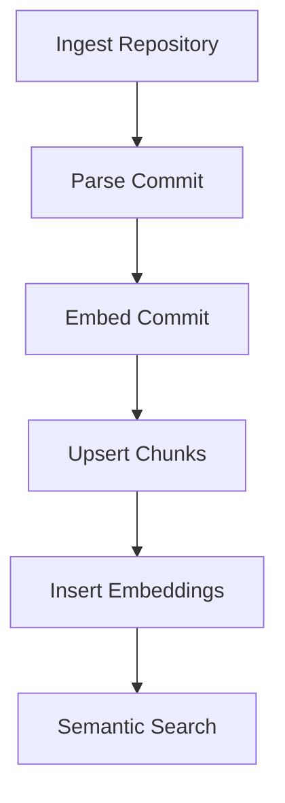

# Services Documentation

## Overview
This documentation provides an overview of the ingestion, parsing, embedding, indexing, and search services used in the system. These services work together to process code and markdown files from repositories, generate embeddings, and facilitate semantic search.

## How it Works
The services operate in a flow that includes the following steps:

1. **Ingestion**: The `ingestRepository` function retrieves files from a specified commit in a Git repository and prepares a manifest of the files to be processed.
2. **Parsing**: The `parseCommit` function processes the files listed in the manifest, normalizing their content and splitting them into manageable chunks.
3. **Embedding**: The `embedCommit` function computes embeddings for the parsed chunks using an embedding model.
4. **Indexing**: The `upsertChunks` function stores the chunk metadata in a database, while `insertEmbeddings` saves the computed embeddings.
5. **Searching**: The `semanticSearch` function allows for querying the indexed chunks using embeddings to find relevant code snippets.

### Flow Diagram

## Key Components

### Ingestion Service
- **Function**: `ingestRepository`
- **Purpose**: Retrieves files from a Git repository and prepares a manifest.
- **Parameters**:
  - `owner`: Repository owner.
  - `repo`: Repository name.
  - `commit`: Commit SHA or branch.
  - `cfg`: Configuration for file inclusion/exclusion.

### Parsing Service
- **Function**: `parseCommit`
- **Purpose**: Normalizes and chunks the content of files.
- **Outputs**:
  - Metadata for chunks.
  - Optional JSONL files containing chunk text.

### Embedding Service
- **Function**: `embedCommit`
- **Purpose**: Computes embeddings for parsed chunks.
- **Parameters**:
  - `s3`: S3 client for storage.
  - `layout`: Layout configuration.
  - `embedder`: Embedding model interface.

### Indexing Service
- **Functions**:
  - `upsertChunks`: Inserts or updates chunk metadata in the database.
  - `insertEmbeddings`: Saves embeddings to the database.
  
### Search Service
- **Function**: `semanticSearch`
- **Purpose**: Executes a search query against the indexed chunks using embeddings.
- **Parameters**:
  - `owner`: Repository owner.
  - `repo`: Repository name.
  - `queryVector`: Vector representation of the search query.

## Gotchas
- Ensure that the embedding model used in `embedCommit` is compatible with the data being processed.
- The `parseCommit` function defaults to writing JSONL files; this can be toggled with the `writePerFileJsonl` parameter.
- The `semanticSearch` function's performance may vary based on the size of the dataset and the complexity of the queries.

### Gaps
- The documentation does not cover specific error handling mechanisms or performance optimizations for each service. For more details, refer to the source code and comments within the respective service files.
- There is no information on the configuration options available for the embedding models or the specifics of the database schema used for storing chunks and embeddings.

For further exploration, please refer to the source code in the respective service files:
- Ingestion: `src/services/ingestService.ts`
- Parsing: `src/services/parserService.ts`
- Embedding: `src/services/embedService.ts`
- Indexing: `src/services/indexerService.ts`
- Search: `src/services/searchService.ts`