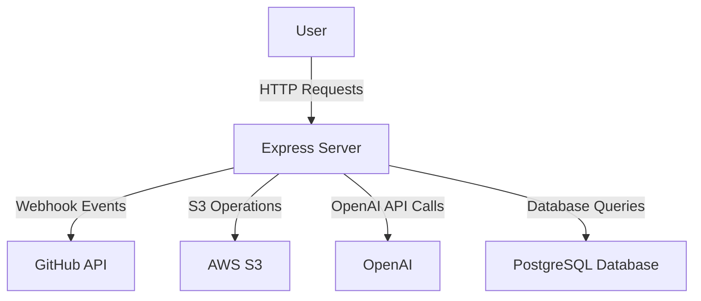
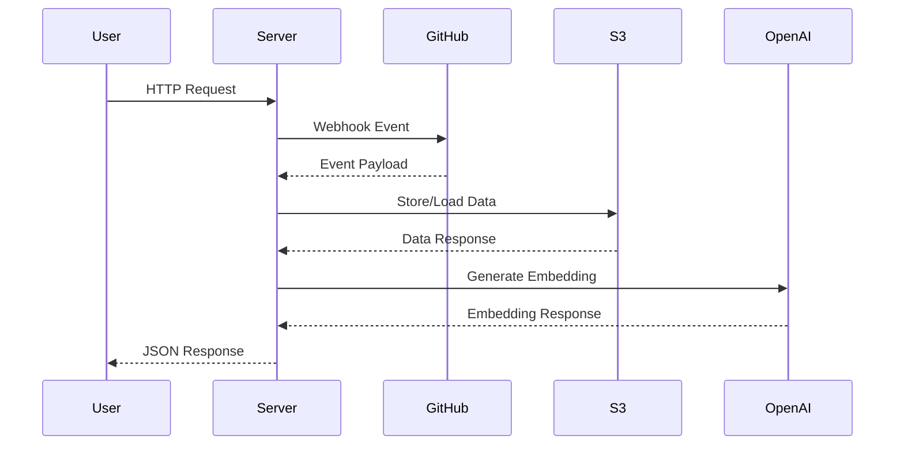

# System Architecture

## Overview
The system is a TypeScript-based Node.js server built with Express, designed to manage and process GitHub repository data. It includes capabilities for ingesting repository data, generating documentation, and providing a question-answering interface based on the repository's content. The architecture supports interactions with external services like AWS S3 for storage and OpenAI for embedding and generating text.

## System Context (Mermaid)

## Components

### 1. Controllers
- **GitHubController** (src/controllers/githubController.ts)
  - **Responsibility**: Handles GitHub webhook events, user repository requests, and manages new repository detection.
  - **Inputs/Outputs**: 
    - Input: Webhook payloads, HTTP requests.
    - Output: JSON responses with repository data or status.
  - **Dependencies**: `ingestService`, `parserService`, `indexerService`, `confluencePublisher`.
  
### 2. Services
- **DocumentationService** (src/services/documentationService.ts)
  - **Responsibility**: Generates documentation for repositories based on specified sections and queries.
  - **Inputs/Outputs**: 
    - Input: Options including owner, repo, commit, sections.
    - Output: Generated documentation files.
  - **Dependencies**: `OpenAIGenerator`, `semanticSearch`, `loadChunkTexts`.

- **IngestService** (src/services/ingestService.ts)
  - **Responsibility**: Ingests repository data from GitHub and processes it for storage.
  - **Inputs/Outputs**: 
    - Input: Repository owner, repo, commit, configuration options.
    - Output: Manifest of ingested files.
  - **Dependencies**: `Octokit`, `S3Client`.

- **EmbedService** (src/services/embedService.ts)
  - **Responsibility**: Computes embeddings for parsed chunks of a commit.
  - **Inputs/Outputs**: 
    - Input: S3 client, layout, embedder.
    - Output: Stored embeddings in S3.
  - **Dependencies**: `S3Client`, `Embedder`.

### 3. Utilities
- **S3Util** (src/utils/s3Util.ts)
  - **Responsibility**: Provides utility functions for interacting with AWS S3.
  - **Inputs/Outputs**: 
    - Input: S3 client, bucket name, keys.
    - Output: JSON or text data from S3.

### 4. Database
- **PostgreSQL Database** (via src/db.ts)
  - **Responsibility**: Stores metadata about commits, chunks, and embeddings.
  - **Inputs/Outputs**: 
    - Input: SQL queries.
    - Output: Query results.

## Data Flow / Sequence (Mermaid)

## Configuration & Secrets
- **Environment Variables**:
  - `OPENAI_API_KEY`: Used in `OpenAIGenerator` for embedding and generating text.
  - `AWS_REGION`: Configures the S3 client.
  - `S3_BUCKET_NAME`: Specifies the S3 bucket for storage operations.
  - `GITHUB_WEBHOOK_SECRET`: Used for verifying GitHub webhook signatures.

## Reliability & Performance
- **Retries**: Implemented in `confluenceService` for handling 429 and 5xx errors with exponential backoff.
- **Idempotency**: Ensured in database operations to prevent duplicate entries.
- **Rate Limiting**: Not explicitly mentioned; **Unknown** if implemented.

## Security
- **Authentication**: Uses GitHub OAuth for accessing repository data.
- **Webhook Verification**: Validates incoming GitHub webhook signatures using HMAC.
- **Data Access Restrictions**: Controlled via environment variables and API keys.

## Observability
- **Logging**: Basic logging implemented in controllers for request tracking.
- **Health Checks**: Available at `/api/health` endpoint.
- **Metrics**: **Unknown** if detailed metrics are collected.

## Deployment / Runtime Topology
- The application runs as a single Node.js process, potentially in a containerized environment (e.g., Docker). **Unknown** if specific orchestration tools are used.

## Risks & Gaps
- **Unknowns**: 
  - Rate limiting strategies are not detailed.
  - Specific error handling mechanisms beyond basic logging are not defined.
  - Observability metrics collection is not specified.

This documentation provides a structured overview of the system architecture, highlighting key components, their responsibilities, and interactions within the system.