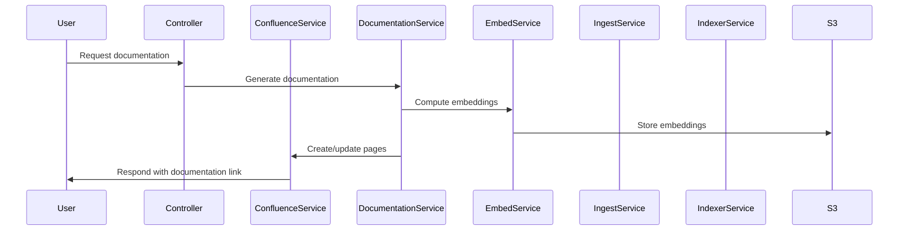

# Service Documentation

> Topics: service modules and business logic in the codebase | files in services folder or files named *service.ts or *Service.ts | classes or functions that implement business workflows or integrations | how services interact with controllers, utils, database, or external APIs | service boundaries, inputs/outputs, and side effects | retry, idempotency, and error handling in services | configuration and environment variables used by services

## Context
The following documentation is derived from the provided code snippets related to various services in the codebase.

## Service Catalogue

### 1. Confluence Service
- **Name/Location**: `src/services/confluenceService.ts` [d98e63bdf69b-0000]
- **Responsibilities**: Interacts with the Confluence API to manage users, spaces, and pages.
- **Public API**:
  - `getMe(): Promise<User>` - Retrieves the current user.
  - `getSpaceByKey(spaceKey: string): Promise<Space | null>` - Fetches a space by its key.
  - `createSpace(spaceKey: string, name: string, desc?: string): Promise<Space>` - Creates a new space.
  - `createPage(spaceId: string, title: string, storageHtml: string, parentId?: string): Promise<Page>` - Creates a new page in a space.
  - `getPageByTitle(spaceId: string, title: string): Promise<Page | null>` - Fetches a page by title.
  - `updatePage(pageId: string, newTitle: string, storageHtml: string): Promise<Page>` - Updates an existing page.
- **Dependencies**: Axios for HTTP requests, environment variables for authentication (Confluence API key, email, base URL). [d98e63bdf69b-0000]
- **Side Effects**: Network calls to the Confluence API, potential writes to the database if integrated. [d98e63bdf69b-0000]
- **Error Handling**: Implements a retry mechanism for 429 and 5xx HTTP responses. [d98e63bdf69b-0000]
- **Configuration**: 
  - `CONFLUENCE_BASE_URL`
  - `CONFLUENCE_EMAIL`
  - `CONFLUENCE_API_KEY` [d98e63bdf69b-0000]

### 2. Documentation Service
- **Name/Location**: `src/services/documentationService.ts` [e96f64df8015-0000]
- **Responsibilities**: Generates documentation based on codebase analysis and user queries.
- **Public API**:
  - `generateDocsLocal(opts: GenOpts): Promise<void>` - Generates documentation locally based on specified options.
- **Dependencies**: 
  - `OpenAIGenerator` for generating text.
  - `semanticSearch` for searching code snippets.
  - `loadChunkTexts` for loading text chunks. [e96f64df8015-0000]
- **Side Effects**: Writes generated documentation to the file system. [e96f64df8015-0000]
- **Error Handling**: Unknown; specifics not provided in the snippets.
- **Configuration**: 
  - `OPENAI_API_KEY`
  - `OPENAI_EMBED_MODEL`
  - `OPENAI_CHAT_MODEL` [e96f64df8015-0000]

### 3. Embed Service
- **Name/Location**: `src/services/embedService.ts` [45ddf38d4fde-0000]
- **Responsibilities**: Computes embeddings for parsed chunks of code.
- **Public API**:
  - `embedCommit(params: { s3: S3Client; layout: S3IngestLayout; embedder: Embedder; ... }): Promise<void>` - Embeds chunks of a commit.
- **Dependencies**: S3 client for storage operations, Embedder interface for embedding logic. [45ddf38d4fde-0000]
- **Side Effects**: Writes embeddings to S3 and potentially to a database. [45ddf38d4fde-0000]
- **Error Handling**: Unknown; specifics not provided in the snippets.
- **Configuration**: Unknown; specifics not provided in the snippets.

### 4. Ingest Service
- **Name/Location**: `src/services/ingestService.ts` [7c8a84372a2b-0000]
- **Responsibilities**: Ingests repositories and manages file processing.
- **Public API**:
  - `ingestRepository(params: { owner: string; repo: string; commit: string; ... }): Promise<ManifestJson>` - Ingests a repository based on the provided parameters.
- **Dependencies**: Octokit for GitHub API interactions, S3 client for storage operations. [7c8a84372a2b-0000]
- **Side Effects**: Writes to S3 and potentially to a database. [7c8a84372a2b-0000]
- **Error Handling**: Unknown; specifics not provided in the snippets.
- **Configuration**: Unknown; specifics not provided in the snippets.

### 5. Indexer Service
- **Name/Location**: `src/services/indexerService.ts` [34bf20c27f27-0000]
- **Responsibilities**: Manages database operations for commits and chunks.
- **Public API**:
  - `saveCommitRow(manifest: ManifestJson): Promise<void>` - Saves a commit row to the database.
  - `upsertChunks(owner: string, repo: string, commitSha: string, chunks: ChunkRecord[]): Promise<void>` - Upserts chunk records into the database.
  - `insertEmbeddings(provider: string, dim: number, rows: { id: string; vector: number[] }[]): Promise<void>` - Inserts embeddings into the database.
- **Dependencies**: Database client for PostgreSQL operations. [34bf20c27f27-0000]
- **Side Effects**: Writes to the database. [34bf20c27f27-0000]
- **Error Handling**: Unknown; specifics not provided in the snippets.
- **Configuration**: Unknown; specifics not provided in the snippets.

### 6. Chunk Text Loader
- **Name/Location**: `src/services/chunkTextLoader.ts` [23da3aeae55f-0000]
- **Responsibilities**: Loads chunk texts from S3 based on chunk IDs.
- **Public API**:
  - `loadChunkTexts(params: { s3: S3Client; bucket: string; ... }): Promise<Record<string, { text: string; filePath: string; startLine: number; endLine: number }>>` - Loads chunk texts from S3.
- **Dependencies**: S3 client for storage operations. [23da3aeae55f-0000]
- **Side Effects**: Reads from S3. [23da3aeae55f-0000]
- **Error Handling**: Unknown; specifics not provided in the snippets.
- **Configuration**: Unknown; specifics not provided in the snippets.

## Interactions

## Gotchas & Constraints
- **Rate Limits**: The Confluence API has rate limits that are handled with retries for specific error codes (429, 5xx) in the Confluence Service. [d98e63bdf69b-0000]
- **Idempotency**: The services should ensure that repeated calls with the same parameters do not result in duplicate entries in the database or S3. [34bf20c27f27-0000]
- **Concurrency**: Unknown; specifics not provided in the snippets.

## Configuration & Secrets
- **Environment Variables**:
  - `CONFLUENCE_BASE_URL`
  - `CONFLUENCE_EMAIL`
  - `CONFLUENCE_API_KEY`
  - `OPENAI_API_KEY`
  - `OPENAI_EMBED_MODEL`
  - `OPENAI_CHAT_MODEL`
  - `SUPABASE