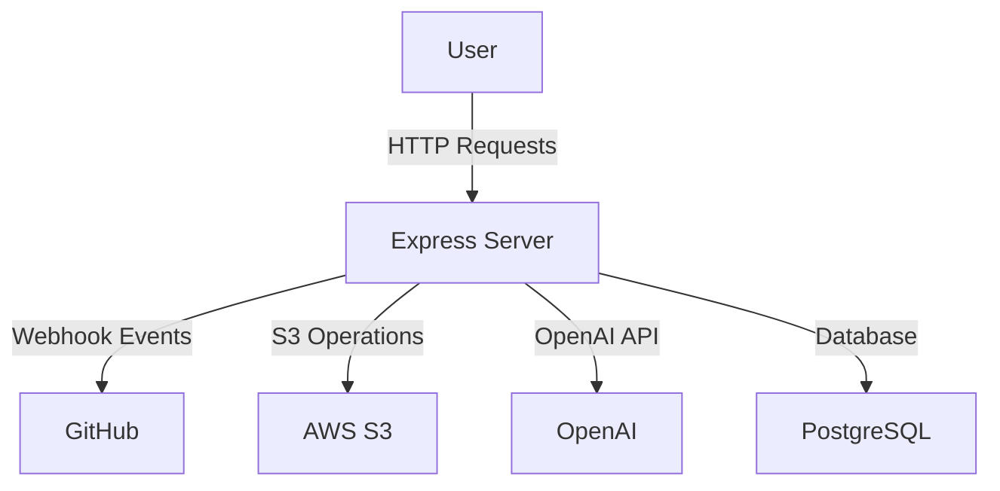
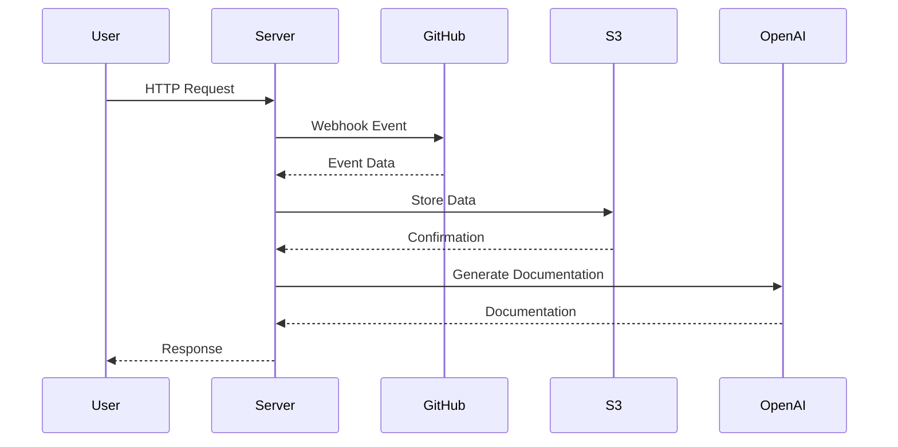

# System Architecture

## Overview
The system is a TypeScript-based Express server designed to handle interactions with GitHub repositories, process documentation, and manage data storage in AWS S3. It integrates with OpenAI for generating documentation and embeddings, and it supports webhook events from GitHub for repository management and updates. Core capabilities include repository ingestion, semantic search, documentation generation, and health monitoring.

## System Context (Mermaid)

## Components

### 1. Controllers
- **GitHubController** (src/controllers/githubController.ts)
  - **Responsibility**: Handles GitHub webhook events, manages user repositories, and processes push events.
  - **Inputs/Outputs**: 
    - Input: HTTP requests from GitHub webhooks.
    - Output: JSON responses with repository data or status.
  - **Dependencies**: `ingestService`, `parserService`, `embedService`, `indexerService`.
  
### 2. Services
- **DocumentationService** (src/services/documentationService.ts)
  - **Responsibility**: Generates documentation based on repository data and user queries.
  - **Inputs/Outputs**: 
    - Input: Options for documentation generation.
    - Output: Generated documentation files.
  - **Dependencies**: `OpenAIGenerator`, `semanticSearch`, `loadChunkTexts`.

- **IngestService** (src/services/ingestService.ts)
  - **Responsibility**: Ingests repository data from GitHub and stores it in S3.
  - **Inputs/Outputs**: 
    - Input: Repository details and configuration.
    - Output: Manifest of ingested files.
  - **Dependencies**: `Octokit`, `S3Client`.

- **EmbedService** (src/services/embedService.ts)
  - **Responsibility**: Computes embeddings for parsed chunks of a commit.
  - **Inputs/Outputs**: 
    - Input: Parsed chunk data.
    - Output: Embedding vectors.
  - **Dependencies**: `S3Client`.

### 3. Utilities
- **S3Util** (src/utils/s3Util.ts)
  - **Responsibility**: Provides utility functions for interacting with AWS S3.
  - **Inputs/Outputs**: 
    - Input: S3 commands and data.
    - Output: S3 responses and data handling.

### 4. Database
- **PostgreSQL** (src/db.ts)
  - **Responsibility**: Manages database connections and queries.
  - **Inputs/Outputs**: 
    - Input: SQL queries.
    - Output: Query results.

## Data Flow / Sequence (Mermaid)

## Configuration & Secrets
- **Environment Variables**:
  - `OPENAI_API_KEY`: Used in `OpenAIGenerator` for API access.
  - `AWS_REGION`: Configures the S3 client.
  - `S3_BUCKET_NAME`: Specifies the S3 bucket for storage.
  - `GITHUB_WEBHOOK_SECRET`: Used for verifying GitHub webhook signatures.

## Reliability & Performance
- **Retries**: Implemented in `confluenceService` for handling 429/5xx errors with exponential backoff [d98e63bdf69b-0000].
- **Idempotency**: Ensured in database operations to prevent duplicate entries during ingestion [34bf20c27f27-0000].
- **Rate Limiting**: Managed through middleware in Express [dedaf00e393f-0000].

## Security
- **Authentication**: Uses GitHub OAuth tokens for API access.
- **Webhook Verification**: Validates incoming GitHub webhook signatures using HMAC [3339a3abe4b6-0001].
- **Data Access Restrictions**: Controlled through environment variables and middleware.

## Observability
- **Logging**: Implemented using middleware to log requests and errors [dedaf00e393f-0000].
- **Health Checks**: Exposed via `/api/health` endpoint to monitor service status [ad7f6bcabc4e-0000].

## Deployment / Runtime Topology
- The application runs in a containerized environment, likely using Docker, with services deployed as separate containers for scalability and isolation.

## Risks & Gaps
- **Unknown**: Specific details about the deployment environment (e.g., orchestration tools like Kubernetes) are not provided in the snippets.
- **TODOs**: Implement comprehensive error handling and logging for all services to ensure robustness.