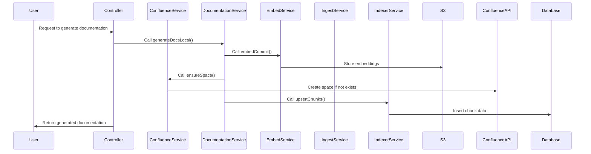

# Service Documentation

> Topics: service modules and business logic in the codebase

## Context
The documentation is derived from various service modules within the codebase, specifically focusing on their responsibilities, public APIs, dependencies, side effects, error handling, and configuration.

## Service Catalogue

### 1. **Confluence Service** (src/services/confluenceService.ts)
- **Responsibilities**: Interacts with Confluence API to manage spaces and pages.
- **Public API**:
  - `getMe(): Promise<User>` - Retrieves the current user.
  - `getSpaceByKey(spaceKey: string): Promise<Space | null>` - Fetches a space by its key.
  - `createSpaceV2(spaceKey: string, name: string, desc?: string): Promise<Space>` - Creates a space using v2 API.
  - `createSpaceV1(spaceKey: string, name: string, desc?: string): Promise<Space>` - Creates a space using v1 API.
  - `createPage(spaceId: string, title: string, storageHtml: string, parentId?: string): Promise<Page>` - Creates a page in a space.
  - `getPageByTitle(spaceId: string, title: string): Promise<Page | null>` - Retrieves a page by title.
- **Dependencies**: Axios for HTTP requests.
- **Side Effects**: Network calls to Confluence API.
- **Error Handling**: Implements retries for 429 and 5xx status codes.
- **Configuration**: Uses environment variables for base URL, email, and API key. [d98e63bdf69b-0000]

### 2. **Documentation Service** (src/services/documentationService.ts)
- **Responsibilities**: Generates documentation based on codebase analysis.
- **Public API**:
  - `generateDocsLocal(opts: GenOpts): Promise<void>` - Generates documentation locally based on specified options.
- **Dependencies**: Utilizes OpenAI for embedding queries and generating text.
- **Side Effects**: Writes generated documentation to the filesystem.
- **Error Handling**: Unknown.
- **Configuration**: Uses environment variables for OpenAI API key and model settings. [e96f64df8015-0000]

### 3. **Embed Service** (src/services/embedService.ts)
- **Responsibilities**: Computes embeddings for parsed chunks of a commit.
- **Public API**:
  - `embedCommit(params: { s3: S3Client; layout: S3IngestLayout; embedder: Embedder; ... }): Promise<void>` - Embeds chunks and optionally writes to S3.
- **Dependencies**: AWS S3 SDK for storage operations.
- **Side Effects**: Writes embeddings to S3 and potentially to a database.
- **Error Handling**: Unknown.
- **Configuration**: Unknown. [45ddf38d4fde-0000]

### 4. **Ingest Service** (src/services/ingestService.ts)
- **Responsibilities**: Ingests repositories and manages file processing.
- **Public API**:
  - `ingestRepository(params: { owner: string; repo: string; commit: string; ... }): Promise<ManifestJson>` - Ingests a repository and returns a manifest.
- **Dependencies**: Octokit for GitHub API interactions, AWS S3 SDK.
- **Side Effects**: Downloads files from GitHub and may upload to S3.
- **Error Handling**: Unknown.
- **Configuration**: Unknown. [7c8a84372a2b-0000]

### 5. **Indexer Service** (src/services/indexerService.ts)
- **Responsibilities**: Manages database operations for commits and chunks.
- **Public API**:
  - `saveCommitRow(manifest: ManifestJson): Promise<void>` - Saves commit information to the database.
  - `upsertChunks(owner: string, repo: string, commitSha: string, chunks: ChunkRecord[]): Promise<void>` - Inserts or updates chunk records.
  - `insertEmbeddings(provider: string, dim: number, rows: { id: string; vector: number[] }[]): Promise<void>` - Inserts embeddings into the database.
- **Dependencies**: Database client for PostgreSQL.
- **Side Effects**: Writes to the database.
- **Error Handling**: Unknown.
- **Configuration**: Uses environment variables for database connection. [34bf20c27f27-0000]

### 6. **Chunk Text Loader** (src/services/chunkTextLoader.ts)
- **Responsibilities**: Loads chunk texts from S3.
- **Public API**:
  - `loadChunkTexts(params: { s3: S3Client; bucket: string; ... }): Promise<Record<string, { text: string; ... }>>` - Loads chunk texts based on provided parameters.
- **Dependencies**: AWS S3 SDK.
- **Side Effects**: Reads from S3.
- **Error Handling**: Unknown.
- **Configuration**: Unknown. [23da3aeae55f-0000]

### 7. **Commit Resolver** (src/services/commitResolver.ts)
- **Responsibilities**: Resolves the latest commit for a repository.
- **Public API**:
  - `resolveLatestCommit(opts: { s3: S3Client; bucket: string; ... }): Promise<string>` - Resolves the latest commit SHA.
- **Dependencies**: AWS S3 SDK.
- **Side Effects**: Reads from S3.
- **Error Handling**: Throws an error if the commit cannot be resolved.
- **Configuration**: Unknown. [f9ceeab4d0235f-0000]

### 8. **Search Service** (src/services/searchService.ts)
- **Responsibilities**: Performs semantic searches on embeddings.
- **Public API**:
  - `semanticSearch(opts: { owner: string; repo: string; queryVector: number[]; ... }): Promise<SearchHit[]>` - Executes a semantic search.
- **Dependencies**: Database client for PostgreSQL.
- **Side Effects**: Reads from the database.
- **Error Handling**: Unknown.
- **Configuration**: Unknown. [beb3b4d0235f-0000]

## Interactions

## Gotchas & Constraints
- **Performance Notes**: The Confluence service implements a simple retry mechanism for specific HTTP status codes (429 and 5xx) to handle rate limits and temporary failures. [d98e63bdf69b-0000]
- **Idempotency**: The `upsertChunks` function in the Indexer Service ensures that duplicate entries are handled gracefully by using the `ON CONFLICT` clause in SQL. [34bf20c27f27-0000]
- **Concurrency Concerns**: Unknown for most services; specific concurrency handling mechanisms are not detailed in the snippets.