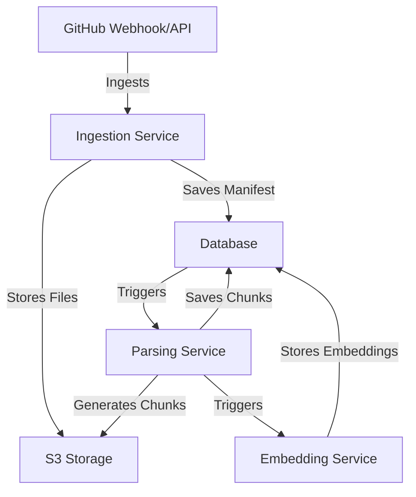

# System Architecture

## Overview
The system architecture of the application is designed to efficiently handle the ingestion, parsing, embedding, and storage of code repositories. It utilizes AWS S3 for storage, a queue system for background tasks, and webhook triggers for event-driven processing. This architecture allows for scalable and robust handling of repository data.

## How it Works
The system follows a structured flow from ingestion to storage:

1. **Ingestion**: The application ingests repository data from GitHub using a webhook or API call. It collects relevant files based on specified inclusion and exclusion patterns.
2. **Parsing**: The ingested files are parsed to extract meaningful chunks of code or documentation.
3. **Embedding**: The parsed chunks are then transformed into embeddings using an AI model, which allows for semantic search capabilities.
4. **Storage**: The embeddings and metadata are stored in a PostgreSQL database, while the raw files and parsed chunks are stored in S3.

### Data Flow

## Key Components
- **Ingestion Service**: Responsible for fetching repository data and saving it to S3 and the database. It uses a manifest to track ingested files and their metadata [3339a3abe4b6-0000].
- **Parsing Service**: Processes the ingested files to create structured chunks of code or documentation. It normalizes text and splits files into manageable pieces [149ebc4a9df3-0000].
- **Embedding Service**: Converts parsed chunks into embeddings using AI models, enabling semantic search capabilities [45ddf38d4fde-0000].
- **Storage**: Utilizes AWS S3 for raw file storage and a PostgreSQL database for structured data, including commit metadata and embeddings [34bf20c27f27-0000].

### S3 Layout
The S3 storage layout follows a structured format:
- `tenants/{tenantId}/repos/{owner}/{repo}/commits/{commit}/`
  - `manifest.json`: Contains metadata about the ingested files.
  - `parse/chunks/`: Stores the parsed chunks in JSONL format.
  - `parse/embeddings/`: Stores the embeddings generated from the chunks.

## Gotchas
- **Webhook Configuration**: Ensure that the GitHub webhook is correctly configured to trigger the ingestion process. Missing or misconfigured webhooks can lead to data not being ingested.
- **File Size Limits**: The ingestion process has a maximum file size limit (e.g., 800 KB) which can be configured. Files exceeding this limit will be skipped [3339a3abe4b6-0000].
- **Error Handling**: Proper error handling is crucial, especially during the parsing and embedding phases, as failures can lead to incomplete data being stored [3339a3abe4b6-0001].

### Conclusion
This architecture provides a robust framework for managing code repositories, leveraging cloud storage and AI capabilities to enhance the usability and accessibility of code data. For further details, refer to the respective service implementations and configurations.