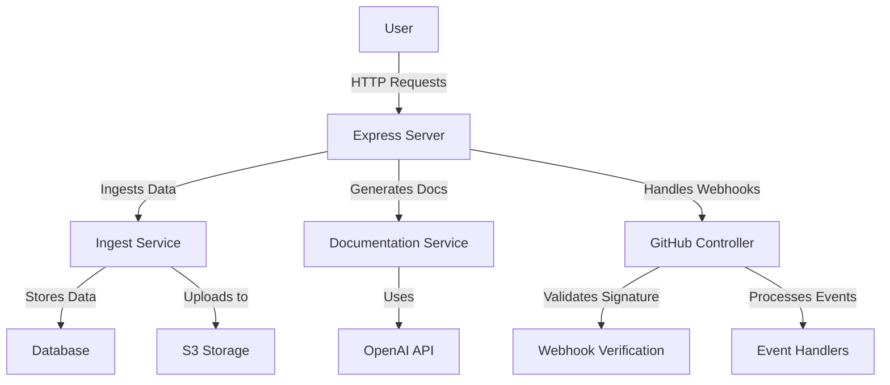
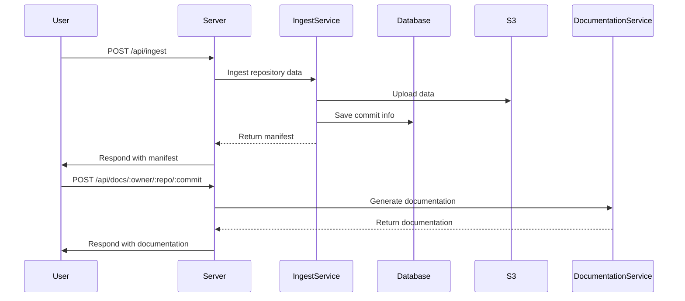

# System Architecture

## Overview
The system is a TypeScript-based Express server designed to manage and process GitHub repository data. It provides functionalities for ingesting repository data, generating documentation, and handling webhook events from GitHub. The core capabilities include:
- Ingesting repository data and storing it in a structured format.
- Generating documentation based on the ingested data.
- Handling GitHub webhook events for real-time updates and actions.

## System Context (Mermaid)

## Components

### 1. Express Server (src/server.ts)
- **Responsibility**: Acts as the main entry point for handling HTTP requests and routing them to appropriate controllers.
- **Inputs/Outputs**: Receives HTTP requests and sends JSON responses.
- **Dependencies**: Express, CORS, body-parser, routes.

### 2. GitHub Controller (src/controllers/githubController.ts)
- **Responsibility**: Handles GitHub-related requests, including webhook events and user repository queries.
- **Inputs/Outputs**: Processes incoming webhook payloads and responds to user requests.
- **Dependencies**: GitHub API, Webhook verification logic.

### 3. Ingest Service (src/services/ingestService.ts)
- **Responsibility**: Ingests repository data from GitHub and stores it in a structured format.
- **Inputs/Outputs**: Takes repository details and configuration, outputs a manifest of ingested data.
- **Dependencies**: Octokit (GitHub API client), S3Client for storage.

### 4. Documentation Service (src/services/documentationService.ts)
- **Responsibility**: Generates documentation based on the ingested repository data.
- **Inputs/Outputs**: Takes repository details and sections to generate, outputs documentation files.
- **Dependencies**: OpenAI API for generating text.

### 5. Database (src/db.ts)
- **Responsibility**: Manages data persistence for repository commits and chunks.
- **Inputs/Outputs**: Executes SQL queries to insert or update records.
- **Dependencies**: PostgreSQL.

### 6. S3 Storage (src/utils/s3Util.ts)
- **Responsibility**: Handles interactions with AWS S3 for storing and retrieving files.
- **Inputs/Outputs**: Uploads and downloads JSON and text files.
- **Dependencies**: AWS SDK.

## Data Flow / Sequence (Mermaid)

## Configuration & Secrets
- **OPENAI_API_KEY**: Used in `OpenAIGenerator` for generating documentation and embeddings.
- **AWS_REGION**: Specifies the AWS region for S3 operations.
- **S3_BUCKET_NAME**: The name of the S3 bucket used for storing ingested data.
- **GITHUB_WEBHOOK_SECRET**: Used for verifying the authenticity of GitHub webhook requests.

## Reliability & Performance
- **Retries**: Implemented in various services to handle transient errors during API calls.
- **Idempotency**: Ensured in the ingest process to avoid duplicate entries in the database.
- **Rate Limiting**: Not explicitly mentioned; **Unknown** if implemented.
- **Caching**: Not explicitly mentioned; **Unknown** if implemented.

## Security
- **Authentication/Authorization**: Uses GitHub OAuth for API access.
- **Webhook Verification**: Validates incoming webhook signatures using HMAC with a secret key [3339a3abe4b6-0001].
- **Data Access Restrictions**: Not explicitly mentioned; **Unknown** if implemented.

## Observability
- **Logging**: Basic logging implemented in controllers and services for tracking requests and errors.
- **Metrics**: Not explicitly mentioned; **Unknown** if implemented.
- **Health Checks**: Implemented in `HealthController` to monitor service status.

## Deployment / Runtime Topology
- The application runs as a single Express server instance, potentially in a containerized environment (e.g., Docker). **Unknown** if specific deployment configurations are used.

## Risks & Gaps
- **Rate Limiting**: Not confirmed if implemented.
- **Caching Strategies**: Not detailed in the snippets.
- **Error Handling**: General error handling is present, but specific strategies for different error types are not detailed.