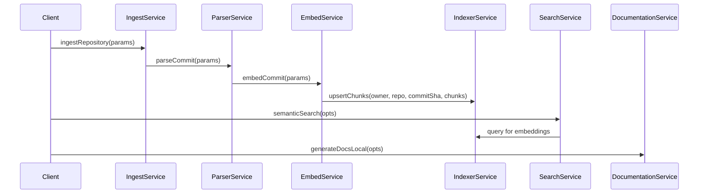

# Service Documentation

> Topics: service modules and business logic in the codebase

## Context
The following documentation is derived from the provided code snippets related to various services in the codebase.

## Service Catalogue

### Service: `documentationService` (src/services/documentationService.ts)
- **Responsibilities**: Generates documentation based on codebase commits, leveraging OpenAI's embedding and generation capabilities. It handles the embedding of queries and the generation of documentation sections.
- **Public API**:
  - `generateDocsLocal(opts: GenOpts): Promise<void>`
    - **Params**: 
      - `owner`: string
      - `repo`: string
      - `commit`: string
      - `outDir?`: string
      - `tenantId?`: string
      - `bucket?`: string
      - `sections`: DocSectionSpec[]
      - `capSnippetChars?`: number
      - `keepIfCategory?`: boolean
    - **Returns**: Promise<void]
- **Dependencies**: 
  - `OpenAIGenerator` from `../ai/adapters/openaiGenerator`
  - `semanticSearch` from `./searchService`
  - `loadChunkTexts` from `./chunkTextLoader`
- **Side Effects**: Writes generated documentation to the file system.
- **Error Handling**: Not explicitly defined; relies on standard Promise rejection.
- **Configuration**: Uses environment variables for OpenAI API keys and models.

### Service: `embedService` (src/services/embedService.ts)
- **Responsibilities**: Computes embeddings for parsed chunks of a commit and manages their storage in S3.
- **Public API**:
  - `embedCommit(params: { s3: S3Client; layout: S3IngestLayout; embedder: Embedder; batchSize?: number; partSize?: number; onBatchVectors?: (rows: { id: string; vector: number[] }[]) => Promise<void>; }): Promise<void>`
    - **Params**: 
      - `s3`: S3Client
      - `layout`: S3IngestLayout
      - `embedder`: Embedder
      - `batchSize?`: number
      - `partSize?`: number
      - `onBatchVectors?`: function
    - **Returns**: Promise<void>
- **Dependencies**: 
  - S3 utilities from `../utils/s3Util`
  - `Embedder` interface from `../ai/interfaces`
- **Side Effects**: Writes embeddings to S3.
- **Error Handling**: Not explicitly defined; relies on standard Promise rejection.
- **Configuration**: None specified.

### Service: `ingestService` (src/services/ingestService.ts)
- **Responsibilities**: Ingests repositories by downloading files, filtering them based on configuration, and storing metadata in S3.
- **Public API**:
  - `ingestRepository(params: { owner: string; repo: string; commit: string; installationId?: number; cfg: IncludeExclude; s3?: S3Client; layout?: S3IngestLayout; dryRun?: boolean; saveTarball?: boolean; branch?: string; }): Promise<ManifestJson>`
    - **Params**: 
      - `owner`: string
      - `repo`: string
      - `commit`: string
      - `installationId?`: number
      - `cfg`: IncludeExclude
      - `s3?`: S3Client
      - `layout?`: S3IngestLayout
      - `dryRun?`: boolean
      - `saveTarball?`: boolean
      - `branch?`: string
    - **Returns**: Promise<ManifestJson>
- **Dependencies**: 
  - Octokit from `@octokit/rest`
  - S3 utilities from `../utils/s3Util`
- **Side Effects**: Downloads files from GitHub and uploads metadata to S3.
- **Error Handling**: Not explicitly defined; relies on standard Promise rejection.
- **Configuration**: None specified.

### Service: `parserService` (src/services/parserService.ts)
- **Responsibilities**: Parses code and markdown files for a given commit manifest and produces chunked outputs.
- **Public API**:
  - `parseCommit(params: { s3: S3Client; layout: S3IngestLayout; writePerFileJsonl?: boolean; modelLabel?: string; targetTokensPerChunk?: number; }): Promise<void>`
    - **Params**: 
      - `s3`: S3Client
      - `layout`: S3IngestLayout
      - `writePerFileJsonl?`: boolean
      - `modelLabel?`: string
      - `targetTokensPerChunk?`: number
    - **Returns**: Promise<void>
- **Dependencies**: 
  - S3 utilities from `../utils/s3Util`
- **Side Effects**: Writes parsed chunks to S3.
- **Error Handling**: Not explicitly defined; relies on standard Promise rejection.
- **Configuration**: None specified.

### Service: `indexerService` (src/services/indexerService.ts)
- **Responsibilities**: Manages the storage of commit and chunk metadata in the database.
- **Public API**:
  - `saveCommitRow(manifest: ManifestJson): Promise<void>`
    - **Params**: 
      - `manifest`: ManifestJson
    - **Returns**: Promise<void>
  - `upsertChunks(owner: string, repo: string, commitSha: string, chunks: ChunkRecord[]): Promise<void>`
    - **Params**: 
      - `owner`: string
      - `repo`: string
      - `commitSha`: string
      - `chunks`: ChunkRecord[]
    - **Returns**: Promise<void>
- **Dependencies**: 
  - Database utilities from `../db`
- **Side Effects**: Writes metadata to the database.
- **Error Handling**: Not explicitly defined; relies on standard Promise rejection.
- **Configuration**: None specified.

### Service: `searchService` (src/services/searchService.ts)
- **Responsibilities**: Performs semantic searches on embeddings stored in the database.
- **Public API**:
  - `semanticSearch(opts: { owner: string; repo: string; queryVector: number[]; topK?: number; provider?: string; }): Promise<SearchHit[]>`
    - **Params**: 
      - `owner`: string
      - `repo`: string
      - `queryVector`: number[]
      - `topK?`: number
      - `provider?`: string
    - **Returns**: Promise<SearchHit[]>
- **Dependencies**: 
  - Database utilities from `../db`
- **Side Effects**: None specified.
- **Error Handling**: Not explicitly defined; relies on standard Promise rejection.
- **Configuration**: None specified.

## Interactions

## Gotchas & Constraints
- **Performance**: The services may experience latency due to network calls to S3 and database interactions.
- **Rate Limits**: External API calls (e.g., GitHub, OpenAI) may be subject to rate limits.
- **Idempotency**: Services like `upsertChunks` are designed to handle duplicate entries gracefully.
- **Concurrency**: Care should be taken when multiple instances of services are running to avoid race conditions.

## Configuration & Secrets
- **Environment Variables**:
  - `OPENAI_API_KEY`: Used in `documentationService` and `embedService`.
  - `SUPABASE_URL`: Database connection string in `db.ts`.
  - `DB_SSL`: SSL configuration for database connections.

## Reliability & Performance
- **Retries**: Not explicitly defined; services should implement retries for transient errors.
- **Idempotency**: Services like `upsertChunks` handle duplicate entries.
- **Timeouts**: Not specified; should be considered for external API calls.
- **Rate-limiting**: External API calls may